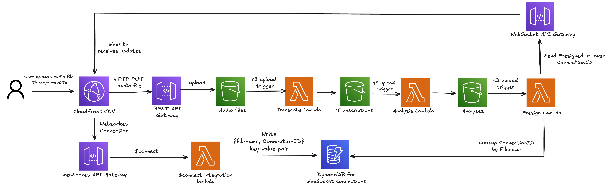

# AudioSummary

A serverless meeting transcription and summarization app built to deepen hands-on experience with **Terraform** and **AWS**. Upload an audio recording and receive an AI-generated summary delivered in real time — no servers to manage, no infrastructure to babysit.

Live at [mrmeeting.net](https://mrmeeting.net).

## Purpose

This project was built as a learning exercise to explore:
- Provisioning and connecting AWS services end-to-end with **Terraform**
- Serverless, event-driven architecture patterns on AWS
- Real-time communication using **WebSockets** on API Gateway
- Integrating managed AI services (**Amazon Bedrock**, **Amazon Transcribe**)

## Architecture



Audio flows through a fully automated, event-driven pipeline:

1. **Upload** — The React frontend sends the audio file via `PUT` directly to S3 through API Gateway (no Lambda involved in the upload path).
2. **Transcribe** — An S3 event triggers a Lambda function that starts an AWS Transcribe job. Transcribe writes the resulting JSON transcript back to a separate S3 bucket.
3. **Summarize** — A second S3 event triggers a Lambda function that reads the transcript and invokes **Claude 3.5 Sonnet** on Amazon Bedrock to generate a timestamped meeting summary.
4. **Notify** — A third Lambda generates a presigned S3 URL for the summary, looks up the user's WebSocket connection ID from DynamoDB, and pushes the URL to the browser in real time.

The user's browser maintains a WebSocket connection (API Gateway v2) for the duration of processing. When the summary is ready, the download link appears automatically — no polling required.

## AWS Services

| Service | Role |
|---|---|
| S3 | Audio uploads, transcription output, analysis output, static website hosting |
| Lambda | Transcription trigger, AI analysis, presigned URL + WebSocket notification, WS connect/disconnect |
| API Gateway (REST) | Audio upload endpoint with direct S3 integration |
| API Gateway (WebSocket) | Real-time result delivery to the browser |
| Amazon Transcribe | Audio-to-text conversion |
| Amazon Bedrock | Meeting summarization via Claude 3.5 Sonnet |
| DynamoDB | WebSocket connection registry (`fileId → connectionId`) |
| CloudFront | CDN for the React frontend |
| Route 53 + ACM | Custom domain and HTTPS certificate |
| Secrets Manager | Centralized API key storage |
| IAM | Per-Lambda least-privilege roles |

## Infrastructure

Everything is provisioned with **Terraform**, organized into one module per service family (`lambda`, `s3bucket`, `dynamo`, `websocket`, `cloudfront`, etc.). No resources are created manually in the console.

```
terraform/
├── main.tf                  # Root module — wires all modules together
└── modules/
    ├── lambda/              # Reusable Lambda + IAM module
    ├── s3bucket/            # S3 bucket with lifecycle rules and event notifications
    ├── dynamo/              # DynamoDB table with optional GSI support
    ├── websocket/           # API Gateway WebSocket API
    ├── gateway/             # API Gateway REST API with direct S3 integration
    ├── cloudfront/          # CloudFront distribution with OAC
    ├── route53/             # DNS records
    ├── acm/                 # TLS certificate with DNS validation
    └── secretsmanager/      # Secrets Manager secret
```

## Frontend

Built with React. Deployed automatically via a **Jenkins** pipeline on every push: `npm ci → npm run build → S3 upload → CloudFront cache invalidation`.

## Testing

Lambda unit tests run automatically on every push via GitHub Actions.

```bash
cd terraform/modules/lambda/disconnect-integration
npm ci
npm test
```
